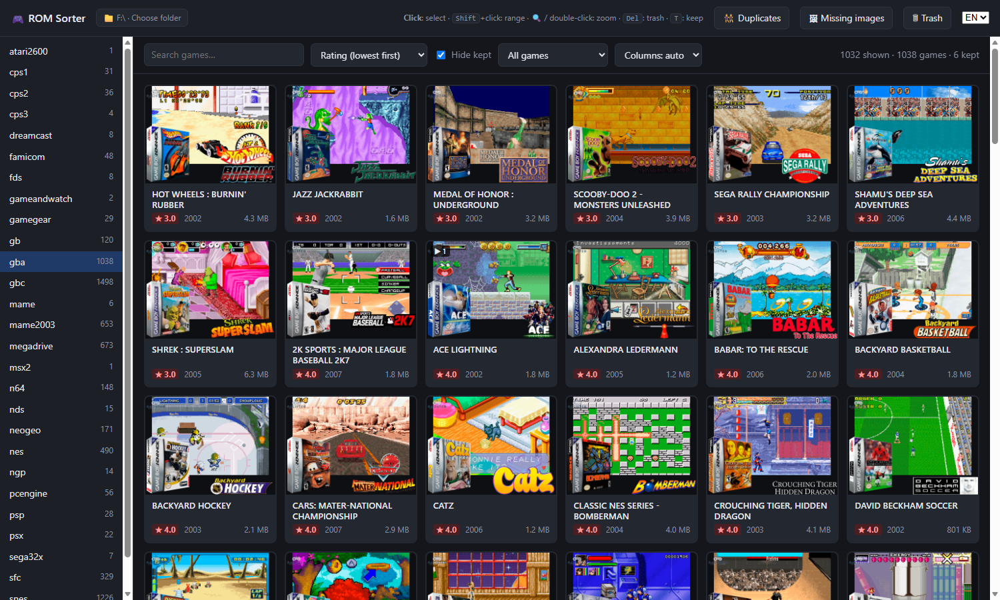
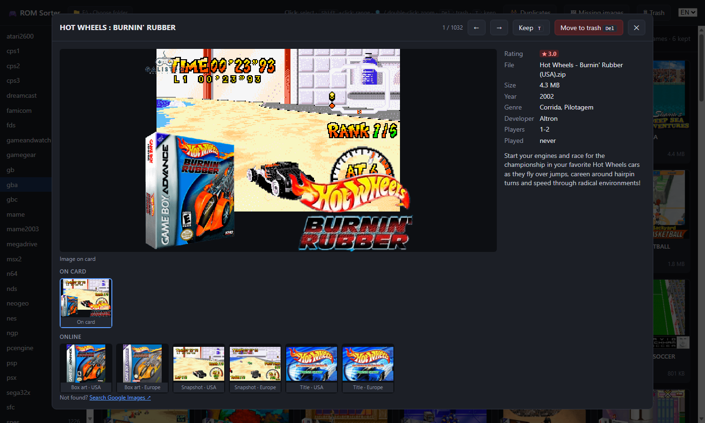

# ROM Sorter (Oyun Ayıkla)

A small local web app to **browse and clean up the games on a retro handheld's SD card**
(R36S, other ArkOS / EmulationStation devices) — with box art, ratings and year, so you can
decide quickly what to keep and what to delete.



**English · [Türkçe](#türkçe)**

## Features

- Grid of every game per system with image, rating, year and size (read from `gamelist.xml`)
- Select with click / Shift+click, **Del** = move to trash, **T** = keep (kept games can be hidden)
- **Trash is safe**: games (with save files, image, video) are moved to `_cop/` on the card and can be
  restored; nothing is deleted until you empty the trash
- **Zoom view** with ← / → navigation and online images from
  [libretro-thumbnails](https://github.com/libretro-thumbnails/libretro-thumbnails); save one to the card
  in a click (it is written to `gamelist.xml`, so the console shows it too)
- **Missing images**: download exact-name matches for every game without an image
- **Duplicates**: finds byte-identical ROMs across systems/folders and suggests which copy to keep
- Adjustable games per row, search, sort, filters; English and Turkish UI



## Requirements

- Python **3.10+** and [Pillow](https://pypi.org/project/pillow/) (installed automatically by the launchers)
- Windows, macOS or Linux; the SD card in a card reader
- Internet only for online images

## Run

```
git clone https://github.com/umutap01/oyun-ayikla.git
cd oyun-ayikla
```

- **Windows:** double-click `baslat.bat`
- **macOS / Linux:** `sh baslat.sh`
- or manually: `pip install -r requirements.txt` then `python src/sunucu.py [ROM_FOLDER]`

Then open **http://127.0.0.1:8736**. The first inserted card is detected automatically; otherwise use
**Choose folder** (the card root or the `roms` folder that contains `nes`, `snes`, `gba`… folders).

App data (kept marks, caches, last folder) is stored in `veri/` next to the code, not on the card.
The server listens on `127.0.0.1` only.

> **Back up your card first.** The app moves and writes files on the card (trash, images, `gamelist.xml`;
> each gamelist is backed up as `gamelist.xml.yedek-…` before writing). No ROMs are included or downloaded.

---

## Türkçe

Retro el konsolu kartındaki (R36S ve diğer ArkOS / EmulationStation cihazları) oyunları resim, puan ve
yılıyla gösterip **ayıklamaya** yarayan küçük yerel web uygulaması.

- Sistem başına tüm oyunlar ızgarada; tıkla/Shift+tıkla seç, **Del** çöpe, **T** tut
- Silme kalıcı değil: oyun kayıt dosyaları ve resmiyle kartta `_cop/` klasörüne taşınır, geri alınır
- Büyüteç: ← / → ile gezinme, libretro-thumbnails'ten resim önerisi, tek tıkla karta kaydetme
- Eksik resimleri toplu indirme, birebir aynı kopyaları bulma, yan yana oyun sayısı, arama/sıralama/süzme
- Arayüz Türkçe ve İngilizce (sağ üstteki TR/EN)

**Çalıştırma:** Python 3.10+ kurulu olmalı. Windows'ta `baslat.bat`, macOS/Linux'ta `sh baslat.sh`;
ardından **http://127.0.0.1:8736**. Takılı kart kendiliğinden bulunur, bulunmazsa "Klasör seç".

> **Önce kartın yedeğini al.** Uygulama kartta dosya taşır ve yazar. ROM içermez, ROM indirmez.

## License

MIT — see [LICENSE](LICENSE).
